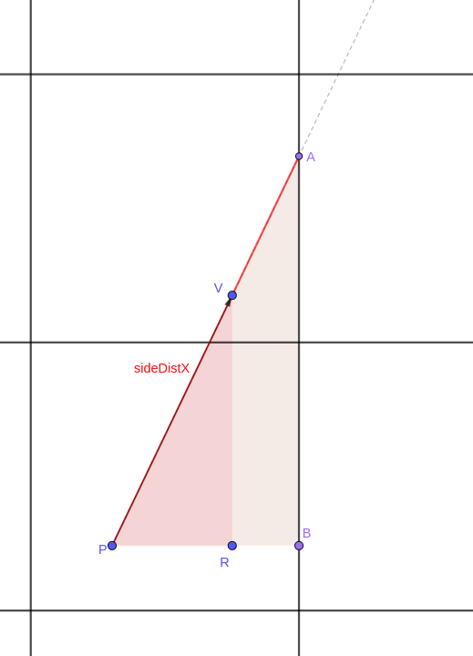

# Table of content

[[toc]]

# Cub3D

# Plan

- Initialiser la structure globale
- Parser et sauvegarder les informations dans la structure globale
- Verifier la validite de la map
- Initialiser la fenetre
- Initialiser les textures
- Definir les hooks
- Lancer le jeu
- Boucler en attendant les hooks

# TODO

- Corriger le petit fisheye.
- Rendre plusieurs inputs simultanes possible.
- Garder une petite marge entre la camera et le mur.
- Lors du deplacement contre un mur de biais, faire glisser le perso contre le mur.
- Creer un hook pour activer/desactiver la minimap.
- Eviter de creer et detruire l'image a chaque cycle de raycasting.

# Raycasting

## Links

https://lodev.org/cgtutor/raycasting.html

## Maths du raycasting

**Notations:**

$||\overrightarrow{v}||$ est la norme du vecteur $\overrightarrow{v}$.

$|x|$ est la valeur absolue du nombre $x$. (`abs` en programmation)

$\lfloor x \rfloor$ est la partie entiere inferieur de x. (`floor` en programmation)

**Contexte**

Je vais essayer de coller le plus possible a lodev, avec des modifications dans les maths la ou je trouve que ma facon de faire est plus simple. Sans pour autant changer le fond de la methode.

On a notre vecteur position $\overrightarrow{pos}$

$$
\overrightarrow{pos} =
	\begin{pmatrix}
	pos_x \\
	pos_y
	\end{pmatrix}
$$

On a notre vecteur direction $\overrightarrow{dir}$

$$
\overrightarrow{dir} =
	\begin{pmatrix}
	dir_x \\
	dir_y
	\end{pmatrix}
$$

et son vecteur $\overrightarrow{plane}$ etant une rotation de $\pi/2$ de $\overrightarrow{dir}$, suivi d une reduction du vecteur.

$$
\overrightarrow{plane} =
	\begin{pmatrix}
	plane_x \\
	plane_y
	\end{pmatrix}
	=
	\begin{pmatrix}
	- 0.66 \times dir_y \\
	0.66 \times dir_x
	\end{pmatrix}
$$

A partir de ces donnees et de la carte, nous devons faire un rendu de la scene.

Voici les grandes etapes. Pour chaque colonne de pixel:

1. Trouver le vecteur unitaire du rayon qu'on lance
2. Determiner la plus courte distance que ce rayon parcours avant de rencontrer un mur. Sauvegarder les coordonnees de l intersection.
3. Determiner l orientation du mur
4. Corriger cette distance pour le fisheye
5. Grace a la distance, determiner la hauteur d affichage du mur sur la colonne de pixel.
6. Grace aux coordonnees de l intersection. Determiner quelle colonne de la texture sera prise pour modele
7. Imprimer de haut en bas sur l image le ciel, puis le nombre de pixel correspondant a la texture, puis le sol.

### Trouver le vecteur unitaire du rayon

Pour une colonne de pixel $x \in [0, \text{ScreenWidth}[$

Definissons la fonction $ray\_deviance(x) \in [-1, 1[$

$$
ray\_deviance(x) = \frac{2 \times x}{\text{ScreenWidth}} - 1
$$

On peut calculer le vecteur $\overrightarrow{ray}$

$$
\overrightarrow{ray} = \overrightarrow{dir} + ray\_deviance(x) \times \overrightarrow{plane}
$$

Le vecteur $\overrightarrow{ray}$ n etant pas unitaire, on le divise par sa norme

$$
\overrightarrow{ray} = \frac{\overrightarrow{dir} + ray\_deviance(x) \times \overrightarrow{plane}}{||\overrightarrow{dir} + ray\_deviance(x) \times \overrightarrow{plane}||}
$$

A ce moment, on definit egalement le sens de changement sur les axes $x$ et $y$, represente par $side_x$ et $side_y$ respectivement:

$$
side_x = sign(ray_x) \\
side_y = sign(ray_y)
$$

Ainsi, $side_x$ et $side_y$ auront pour valeur $-1$ ou $1$.

(Pour une resolution 1800x900, ca met environ 70 microsecondes, 11 microsecondes sur Dell )

### Determiner la distance, les coordonnees d intersection et le cote intersecte

Tester les murs pour chaque pixel rendrait le programme tres tres lourd a executer, et donc reduisant fortement les performances du rendu.

Pour determiner les distances, on quitte le monde des vecteurs pour aller dans le monde de la geometrie.

Notamment, on utilisera grandement le [theoreme de Thales](https://fr.wikipedia.org/wiki/Th%C3%A9or%C3%A8me_de_Thal%C3%A8s) ainsi que la propriete de [triangles semblables](https://fr.wikipedia.org/wiki/Triangles_semblables).

Nous avons un point pour la position du joueur $P = (pos_x, pos_y)$.

Un autre point pour pour la position du joueur apres deplacement par le vecteur $\overrightarrow{ray}$, appelons le $V = (pos_x + ray_x, pos_y + ray_y)$.

On peut donc creer un triangle rectangle tel que $PV$ soit l'hypothenuse. Appelons $PRV$ le triangle rectangle en R.

$$
PV = ||\overrightarrow{ray}|| = 1 \\
PR = |ray_x| \\
RV = |ray_y|
$$

Maintenant que la conversion entre le monde des vecteurs et le monde de la geometrie est faite. Qu'est ce qu'on cherche ??

- La distance parcourue par le rayon en partant d'un mur vertical pour atteindre le mur vertical suivant ($ddist_x$ sur lodev)
- La distance parcourue par le rayon en partant d'un mur horizontal pour atteindre le mur horizontal suivant ($ddist_y$ sur lodev)
- La distance parcourue par le rayon en partant de $P$ pour intersecter le premier mur vertical ($sd_dist_x$ sur lodev)
- La distance parcourue par le rayon en partant de $P$ pour intersecter le premier mur horizontal ($sd_dist_y$ sur lodev)

**Pour le premier point: ddist_x**

On peut former un triangle rectangle ABC, rectangle en B, entre les deux murs. On connait ceci:

$$
AB = 1\\
AC = ddist_x
$$

On remarque egalement que les triangles PRV et ABC sont semblables. On peut donc y appliquer le theoreme de Thales.

$$
\frac{AC}{PV} = \frac{AB}{PR}\\
\frac{ddist_x}{1} = \frac{1}{|ray_x|}\\
ddist_x = \frac{1}{|ray_x|}
$$

(Plus simple que lodev non ?)

**Pour le deuxieme point: ddist_y**

C'est la meme idee pour $ddist_y$.

Je mets quand meme l'image et la formule finale.

$$
ddist_y = \frac{1}{|dir_y|}
$$

**Pour le troisieme point: sd_dist_x**

Pour on peut appliquer la meme logique, ou alors on peut remarquer que notre $sd_dist_x$ n est que notre $ddist_x$ mais raccourci de la meme proportion que notre point $P$ est eloigne du mur (qui sera intersecte) par rapport a 1.

Ainsi, nous avons simplement a trouver la distance sur l'axe de $x$ de $P$ au prochain mur vertical.

Il suffit donc de multiplier $ddist_x$ par la longueur $PB$.

On obtient donc

$$
sd_dist_x = ddist_x \times PB
$$

Attention, le calcul de $PB$ peut etre trompeur. En fonction de l orientation du vecteur $\overrightarrow{ray}$ sur l axe des $x$, on ne va pas aller chercher le meme cote pour calculer $PB$.

Nous avons sauvegarde l orientation de $\overrightarrow{ray}$ sur l axe des $x$ dans la partie precedente: $side_x$.

$$
\begin{equation}
\left\{
\begin{aligned}
	PB &= pos_x - \lfloor pos_x \rfloor &\text{si } side_x < 0\\
	PB &= \lfloor pos_x \rfloor + 1 - pos_x &\text{sinon}
\end{aligned}
\right.
\end{equation}
$$

En gros

$$
\begin{equation}
\left\{
\begin{aligned}
	sd_dist_x &= ddist_x \times (pos_x - \lfloor pos_x \rfloor) &\text{si } side_x < 0\\
	sd_dist_x &= ddist_x \times (\lfloor pos_x \rfloor + 1 - pos_x) &\text{sinon}
\end{aligned}
\right.
\end{equation}
$$

**Pour le quatrieme point: sd_dist_y**

Meme logique:

$$
\begin{equation}
\left\{
\begin{aligned}
	sd_dist_y &= ddist_y \times (pos_y - \lfloor pos_y \rfloor) &\text{si } side_y < 0\\
	sd_dist_y &= ddist_y \times (\lfloor pos_y \rfloor + 1 - pos_y) &\text{sinon}
\end{aligned}
\right.
\end{equation}
$$

---

Ok ok, mais pourquoi on calcul ca enfaite ? On aime les maths...

Enfaite, ce sont des valeurs utiles pour appliquer le DDA, [Digital Differential Analyzer](https://en.wikipedia.org/wiki/Digital_differential_analyzer_(graphics_algorithm)).

En gros, c'est un algo qui nous permet de sauter directement au prochain carre sans regarder entre les sauts car on sait que ca changera pas.

Donc ici, plus trop de maths, mais de l'algorithmie !

### Corriger la distance pour le fisheye

# Plan de developpement

1. Mettre en place le parsing
2. Creer un affichage de minimap, utile pour debug. Depend de (1)
3. Gerer les inputs, dont la souris, et refresh la minimap. Depend de (1, 2)
4. Gerer les collisions, systeme de porte. Depend de (1, 2, 3)
5. Mettre en place le ray casting connaissant les conditions. Depend de (1)
6. Integerer la minimap et le rendu dans la boucle d'event.
